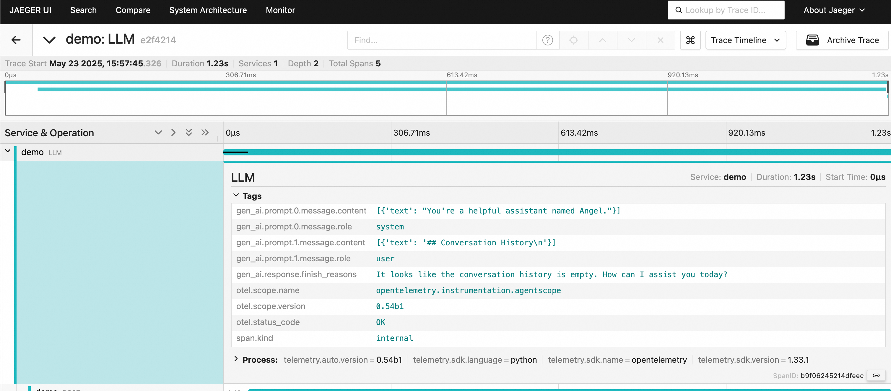

# loongsuite-python-agent


<div align="center">

[English](README.md) | **简体中文**

</div>

## 介绍
LoongSuite Python Agent 是 LoongSuite（阿里巴巴统一可观测数据采集套件）的关键组件，为 Python 应用提供自动埋点（instrumentation）能力。

LoongSuite 包含以下核心组件：
* [LoongCollector](https://github.com/alibaba/loongcollector)：通用节点 Agent，基于 eBPF 提供日志采集、Prometheus 指标采集以及网络与安全采集能力。
* [LoongSuite Python Agent](https://github.com/alibaba/loongsuite-python-agent)：为 Python 应用提供埋点能力的进程 Agent。
* [LoongSuite Go Agent](https://github.com/alibaba/loongsuite-go-agent)：支持编译期埋点的 Golang 进程 Agent。
* [LoongSuite Java Agent](https://github.com/alibaba/loongsuite-java-agent)：面向 Java 应用的进程 Agent。
* 其他语言 Agent 正在建设中。

LoongSuite Python Agent 同时也是上游 [OTel Python Agent](https://github.com/open-telemetry/opentelemetry-python-contrib) 的定制化发行版，增强了对主流 AI Agent 框架的支持。
实现遵循最新的 GenAI [语义约定](https://github.com/open-telemetry/semantic-conventions)。

## 支持的框架与组件

<a id="supported-frameworks-and-components"></a>

### LoongSuite instrumentation

源码目录：[`instrumentation-loongsuite/`](instrumentation-loongsuite)。

| 框架/组件 | 文档 | 发布 |
|--------|------|---------|
| [AgentScope](https://github.com/agentscope-ai/agentscope) | [GUIDE](instrumentation-loongsuite/loongsuite-instrumentation-agentscope/README.md) | [PyPI](https://pypi.org/project/loongsuite-instrumentation-agentscope/) |
| [Agno](https://github.com/agno-agi/agno) | [GUIDE](instrumentation-loongsuite/loongsuite-instrumentation-agno/README.md) | in dev |
| [Claude Agent SDK](https://github.com/anthropics/claude-agent-sdk-python) | [GUIDE](instrumentation-loongsuite/loongsuite-instrumentation-claude-agent-sdk/README.md) | [PyPI](https://pypi.org/project/loongsuite-instrumentation-claude-agent-sdk/) |
| [CrewAI](https://github.com/crewAIInc/crewAI) | [GUIDE](instrumentation-loongsuite/loongsuite-instrumentation-crewai/README.md) | [PyPI](https://pypi.org/project/loongsuite-instrumentation-crewai/) |
| [DashScope](https://github.com/dashscope/dashscope-sdk-python) | [GUIDE](instrumentation-loongsuite/loongsuite-instrumentation-dashscope/README.md) | [PyPI](https://pypi.org/project/loongsuite-instrumentation-dashscope/) |
| [Dify](https://github.com/langgenius/dify) | [GUIDE](instrumentation-loongsuite/loongsuite-instrumentation-dify/README.md) | in dev |
| [Google ADK](https://github.com/google/adk-python) | [GUIDE](instrumentation-loongsuite/loongsuite-instrumentation-google-adk/README.md) | [PyPI](https://pypi.org/project/loongsuite-instrumentation-google-adk/) |
| [LangChain](https://github.com/langchain-ai/langchain) | [GUIDE](instrumentation-loongsuite/loongsuite-instrumentation-langchain/README.md) | [PyPI](https://pypi.org/project/loongsuite-instrumentation-langchain/) |
| [LangGraph](https://github.com/langchain-ai/langgraph) | [GUIDE](instrumentation-loongsuite/loongsuite-instrumentation-langgraph/README.md) | [PyPI](https://pypi.org/project/loongsuite-instrumentation-langgraph/) |
| [LiteLLM](https://github.com/BerriAI/litellm) | [GUIDE](instrumentation-loongsuite/loongsuite-instrumentation-litellm/README.md) | [PyPI](https://pypi.org/project/loongsuite-instrumentation-litellm/) |
| [MCP Python SDK](https://github.com/modelcontextprotocol/python-sdk) | [GUIDE](instrumentation-loongsuite/loongsuite-instrumentation-mcp/README.md) | in dev |
| [Mem0](https://github.com/mem0ai/mem0) | [GUIDE](instrumentation-loongsuite/loongsuite-instrumentation-mem0/README.md) | [PyPI](https://pypi.org/project/loongsuite-instrumentation-mem0/) |

**发行版与辅助组件：**

- **loongsuite-distro** — [https://pypi.org/project/loongsuite-distro/](https://pypi.org/project/loongsuite-distro/)（包含 `loongsuite-instrument`、`loongsuite-bootstrap`）
- **loongsuite-util-genai** — [https://pypi.org/project/loongsuite-util-genai/](https://pypi.org/project/loongsuite-util-genai/)
- **loongsuite-site-bootstrap**— [https://pypi.org/project/loongsuite-site-bootstrap/](https://pypi.org/project/loongsuite-site-bootstrap/)。

### OpenTelemetry instrumentation — 生成式工作负载

源码目录：[`instrumentation-genai/`](instrumentation-genai)。这些发行包遵循 OpenTelemetry 的**生成式 AI**语义约定（PyPI 包名为 `opentelemetry-instrumentation-*`）。

| 框架/组件 | 文档 | 发布 |
|--------|------|---------|
| [Anthropic](https://github.com/anthropics/anthropic-sdk-python) | [GUIDE](instrumentation-genai/opentelemetry-instrumentation-anthropic/README.rst) | [PyPI](https://pypi.org/project/opentelemetry-instrumentation-anthropic/) |
| [Claude Agent SDK](https://github.com/anthropics/claude-agent-sdk-python) | [GUIDE](instrumentation-genai/opentelemetry-instrumentation-claude-agent-sdk/README.rst) | [PyPI](https://pypi.org/project/opentelemetry-instrumentation-claude-agent-sdk/) |
| [Google GenAI](https://github.com/googleapis/python-genai) | [GUIDE](instrumentation-genai/opentelemetry-instrumentation-google-genai/README.rst) | [PyPI](https://pypi.org/project/opentelemetry-instrumentation-google-genai/) |
| [LangChain](https://github.com/langchain-ai/langchain) | [GUIDE](instrumentation-genai/opentelemetry-instrumentation-langchain/README.rst) | [PyPI](https://pypi.org/project/opentelemetry-instrumentation-langchain/) |
| [OpenAI Agents](https://github.com/openai/openai-agents-python) | [GUIDE](instrumentation-genai/opentelemetry-instrumentation-openai-agents-v2/README.rst) | [PyPI](https://pypi.org/project/opentelemetry-instrumentation-openai-agents-v2/) |
| [OpenAI](https://github.com/openai/openai-python) | [GUIDE](instrumentation-genai/opentelemetry-instrumentation-openai-v2/README.rst) | [PyPI](https://pypi.org/project/opentelemetry-instrumentation-openai-v2/) |
| [Vertex AI](https://github.com/googleapis/python-aiplatform) | [GUIDE](instrumentation-genai/opentelemetry-instrumentation-vertexai/README.rst) | [PyPI](https://pypi.org/project/opentelemetry-instrumentation-vertexai/) |
| [Weaviate](https://github.com/weaviate/weaviate) | [GUIDE](instrumentation-genai/opentelemetry-instrumentation-weaviate/README.rst) | [PyPI](https://pypi.org/project/opentelemetry-instrumentation-weaviate/) |

> **说明：**在 LoongSuite 的发行方式下，请将这些包与 [**loongsuite-distro**](https://pypi.org/project/loongsuite-distro/) 以及 **`loongsuite-bootstrap`** / [**loongsuite-util-genai**](https://pypi.org/project/loongsuite-util-genai/) 一起使用。避免将 [**loongsuite-util-genai**](https://pypi.org/project/loongsuite-util-genai/) 与社区版 **opentelemetry-util-genai** 混装（见[手动 `pip` 安装](#install-step-2-options)）。

### OpenTelemetry instrumentation

源码目录：[`instrumentation/`](instrumentation)。这是通用应用与库的埋点集合；PyPI 项目名恒为 `https://pypi.org/project/opentelemetry-instrumentation-<name>/`。下表每一行都包含该 PyPI 链接及本仓库对应 README。

<details>
<summary><b>所有 <code>instrumentation/</code> 包（点击展开）</b></summary>

- **opentelemetry-instrumentation-aio-pika** — [PyPI](https://pypi.org/project/opentelemetry-instrumentation-aio-pika/), [readme](instrumentation/opentelemetry-instrumentation-aio-pika/README.rst)
- **opentelemetry-instrumentation-aiohttp-client** — [PyPI](https://pypi.org/project/opentelemetry-instrumentation-aiohttp-client/), [readme](instrumentation/opentelemetry-instrumentation-aiohttp-client/README.rst)
- **opentelemetry-instrumentation-aiohttp-server** — [PyPI](https://pypi.org/project/opentelemetry-instrumentation-aiohttp-server/), [readme](instrumentation/opentelemetry-instrumentation-aiohttp-server/README.rst)
- **opentelemetry-instrumentation-aiokafka** — [PyPI](https://pypi.org/project/opentelemetry-instrumentation-aiokafka/), [readme](instrumentation/opentelemetry-instrumentation-aiokafka/README.rst)
- **opentelemetry-instrumentation-aiopg** — [PyPI](https://pypi.org/project/opentelemetry-instrumentation-aiopg/), [readme](instrumentation/opentelemetry-instrumentation-aiopg/README.rst)
- **opentelemetry-instrumentation-asgi** — [PyPI](https://pypi.org/project/opentelemetry-instrumentation-asgi/), [readme](instrumentation/opentelemetry-instrumentation-asgi/README.rst)
- **opentelemetry-instrumentation-asyncclick** — [PyPI](https://pypi.org/project/opentelemetry-instrumentation-asyncclick/), [readme](instrumentation/opentelemetry-instrumentation-asyncclick/README.rst)
- **opentelemetry-instrumentation-asyncio** — [PyPI](https://pypi.org/project/opentelemetry-instrumentation-asyncio/), [readme](instrumentation/opentelemetry-instrumentation-asyncio/README.rst)
- **opentelemetry-instrumentation-asyncpg** — [PyPI](https://pypi.org/project/opentelemetry-instrumentation-asyncpg/), [readme](instrumentation/opentelemetry-instrumentation-asyncpg/README.rst)
- **opentelemetry-instrumentation-aws-lambda** — [PyPI](https://pypi.org/project/opentelemetry-instrumentation-aws-lambda/), [readme](instrumentation/opentelemetry-instrumentation-aws-lambda/README.rst)
- **opentelemetry-instrumentation-boto** — [PyPI](https://pypi.org/project/opentelemetry-instrumentation-boto/), [readme](instrumentation/opentelemetry-instrumentation-boto/README.rst)
- **opentelemetry-instrumentation-boto3sqs** — [PyPI](https://pypi.org/project/opentelemetry-instrumentation-boto3sqs/), [readme](instrumentation/opentelemetry-instrumentation-boto3sqs/README.rst)
- **opentelemetry-instrumentation-botocore** — [PyPI](https://pypi.org/project/opentelemetry-instrumentation-botocore/), [readme](instrumentation/opentelemetry-instrumentation-botocore/README.rst)
- **opentelemetry-instrumentation-cassandra** — [PyPI](https://pypi.org/project/opentelemetry-instrumentation-cassandra/), [readme](instrumentation/opentelemetry-instrumentation-cassandra/README.rst)
- **opentelemetry-instrumentation-celery** — [PyPI](https://pypi.org/project/opentelemetry-instrumentation-celery/), [readme](instrumentation/opentelemetry-instrumentation-celery/README.rst)
- **opentelemetry-instrumentation-click** — [PyPI](https://pypi.org/project/opentelemetry-instrumentation-click/), [readme](instrumentation/opentelemetry-instrumentation-click/README.rst)
- **opentelemetry-instrumentation-confluent-kafka** — [PyPI](https://pypi.org/project/opentelemetry-instrumentation-confluent-kafka/), [readme](instrumentation/opentelemetry-instrumentation-confluent-kafka/README.rst)
- **opentelemetry-instrumentation-dbapi** — [PyPI](https://pypi.org/project/opentelemetry-instrumentation-dbapi/), [readme](instrumentation/opentelemetry-instrumentation-dbapi/README.rst)
- **opentelemetry-instrumentation-django** — [PyPI](https://pypi.org/project/opentelemetry-instrumentation-django/), [readme](instrumentation/opentelemetry-instrumentation-django/README.rst)
- **opentelemetry-instrumentation-elasticsearch** — [PyPI](https://pypi.org/project/opentelemetry-instrumentation-elasticsearch/), [readme](instrumentation/opentelemetry-instrumentation-elasticsearch/README.rst)
- **opentelemetry-instrumentation-falcon** — [PyPI](https://pypi.org/project/opentelemetry-instrumentation-falcon/), [readme](instrumentation/opentelemetry-instrumentation-falcon/README.rst)
- **opentelemetry-instrumentation-fastapi** — [PyPI](https://pypi.org/project/opentelemetry-instrumentation-fastapi/), [readme](instrumentation/opentelemetry-instrumentation-fastapi/README.rst)
- **opentelemetry-instrumentation-flask** — [PyPI](https://pypi.org/project/opentelemetry-instrumentation-flask/), [readme](instrumentation/opentelemetry-instrumentation-flask/README.rst)
- **opentelemetry-instrumentation-grpc** — [PyPI](https://pypi.org/project/opentelemetry-instrumentation-grpc/), [readme](instrumentation/opentelemetry-instrumentation-grpc/README.rst)
- **opentelemetry-instrumentation-httpx** — [PyPI](https://pypi.org/project/opentelemetry-instrumentation-httpx/), [readme](instrumentation/opentelemetry-instrumentation-httpx/README.rst)
- **opentelemetry-instrumentation-jinja2** — [PyPI](https://pypi.org/project/opentelemetry-instrumentation-jinja2/), [readme](instrumentation/opentelemetry-instrumentation-jinja2/README.rst)
- **opentelemetry-instrumentation-kafka-python** — [PyPI](https://pypi.org/project/opentelemetry-instrumentation-kafka-python/), [readme](instrumentation/opentelemetry-instrumentation-kafka-python/README.rst)
- **opentelemetry-instrumentation-logging** — [PyPI](https://pypi.org/project/opentelemetry-instrumentation-logging/), [readme](instrumentation/opentelemetry-instrumentation-logging/README.rst)
- **opentelemetry-instrumentation-mysql** — [PyPI](https://pypi.org/project/opentelemetry-instrumentation-mysql/), [readme](instrumentation/opentelemetry-instrumentation-mysql/README.rst)
- **opentelemetry-instrumentation-mysqlclient** — [PyPI](https://pypi.org/project/opentelemetry-instrumentation-mysqlclient/), [readme](instrumentation/opentelemetry-instrumentation-mysqlclient/README.rst)
- **opentelemetry-instrumentation-pika** — [PyPI](https://pypi.org/project/opentelemetry-instrumentation-pika/), [readme](instrumentation/opentelemetry-instrumentation-pika/README.rst)
- **opentelemetry-instrumentation-psycopg** — [PyPI](https://pypi.org/project/opentelemetry-instrumentation-psycopg/), [readme](instrumentation/opentelemetry-instrumentation-psycopg/README.rst)
- **opentelemetry-instrumentation-psycopg2** — [PyPI](https://pypi.org/project/opentelemetry-instrumentation-psycopg2/), [readme](instrumentation/opentelemetry-instrumentation-psycopg2/README.rst)
- **opentelemetry-instrumentation-pymemcache** — [PyPI](https://pypi.org/project/opentelemetry-instrumentation-pymemcache/), [readme](instrumentation/opentelemetry-instrumentation-pymemcache/README.rst)
- **opentelemetry-instrumentation-pymongo** — [PyPI](https://pypi.org/project/opentelemetry-instrumentation-pymongo/), [readme](instrumentation/opentelemetry-instrumentation-pymongo/README.rst)
- **opentelemetry-instrumentation-pymssql** — [PyPI](https://pypi.org/project/opentelemetry-instrumentation-pymssql/), [readme](instrumentation/opentelemetry-instrumentation-pymssql/README.rst)
- **opentelemetry-instrumentation-pymysql** — [PyPI](https://pypi.org/project/opentelemetry-instrumentation-pymysql/), [readme](instrumentation/opentelemetry-instrumentation-pymysql/README.rst)
- **opentelemetry-instrumentation-pyramid** — [PyPI](https://pypi.org/project/opentelemetry-instrumentation-pyramid/), [readme](instrumentation/opentelemetry-instrumentation-pyramid/README.rst)
- **opentelemetry-instrumentation-redis** — [PyPI](https://pypi.org/project/opentelemetry-instrumentation-redis/), [readme](instrumentation/opentelemetry-instrumentation-redis/README.rst)
- **opentelemetry-instrumentation-remoulade** — [PyPI](https://pypi.org/project/opentelemetry-instrumentation-remoulade/), [readme](instrumentation/opentelemetry-instrumentation-remoulade/README.rst)
- **opentelemetry-instrumentation-requests** — [PyPI](https://pypi.org/project/opentelemetry-instrumentation-requests/), [readme](instrumentation/opentelemetry-instrumentation-requests/README.rst)
- **opentelemetry-instrumentation-sqlalchemy** — [PyPI](https://pypi.org/project/opentelemetry-instrumentation-sqlalchemy/), [readme](instrumentation/opentelemetry-instrumentation-sqlalchemy/README.rst)
- **opentelemetry-instrumentation-sqlite3** — [PyPI](https://pypi.org/project/opentelemetry-instrumentation-sqlite3/), [readme](instrumentation/opentelemetry-instrumentation-sqlite3/README.rst)
- **opentelemetry-instrumentation-starlette** — [PyPI](https://pypi.org/project/opentelemetry-instrumentation-starlette/), [readme](instrumentation/opentelemetry-instrumentation-starlette/README.rst)
- **opentelemetry-instrumentation-system-metrics** — [PyPI](https://pypi.org/project/opentelemetry-instrumentation-system-metrics/), [readme](instrumentation/opentelemetry-instrumentation-system-metrics/README.rst)
- **opentelemetry-instrumentation-threading** — [PyPI](https://pypi.org/project/opentelemetry-instrumentation-threading/), [readme](instrumentation/opentelemetry-instrumentation-threading/README.rst)
- **opentelemetry-instrumentation-tornado** — [PyPI](https://pypi.org/project/opentelemetry-instrumentation-tornado/), [readme](instrumentation/opentelemetry-instrumentation-tornado/README.rst)
- **opentelemetry-instrumentation-tortoiseorm** — [PyPI](https://pypi.org/project/opentelemetry-instrumentation-tortoiseorm/), [readme](instrumentation/opentelemetry-instrumentation-tortoiseorm/README.rst)
- **opentelemetry-instrumentation-urllib** — [PyPI](https://pypi.org/project/opentelemetry-instrumentation-urllib/), [readme](instrumentation/opentelemetry-instrumentation-urllib/README.rst)
- **opentelemetry-instrumentation-urllib3** — [PyPI](https://pypi.org/project/opentelemetry-instrumentation-urllib3/), [readme](instrumentation/opentelemetry-instrumentation-urllib3/README.rst)
- **opentelemetry-instrumentation-wsgi** — [PyPI](https://pypi.org/project/opentelemetry-instrumentation-wsgi/), [readme](instrumentation/opentelemetry-instrumentation-wsgi/README.rst)

</details>

## 快速开始

本示例使用 **[AgentScope](https://github.com/agentscope-ai/agentscope)**。安装对应埋点后，其他技术栈也适用同样的 exporter 与 `loongsuite-instrument` 使用方式。

### 准备一个 Demo（AgentScope ReAct 示例）

可参考上游 **[ReAct agent 示例](https://github.com/agentscope-ai/agentscope/tree/main/examples/agent/react_agent)**：你可以克隆 AgentScope，或按该目录中的 `main.py` 对齐。

**步骤 1 — 安装 AgentScope**

  ```bash
  pip install agentscope
  ```

**步骤 2 - 配置 DashScope**

  ```bash
  export DASHSCOPE_API_KEY={your_api_key}
  ```

  将 `{your_api_key}` 替换为在 [DashScope 控制台](https://bailian.console.aliyun.com/#/api-key) 获取的有效密钥。

  若需接入非 DashScope 的模型 API，请参考 AgentScope 文档：[Model tutorial](https://doc.agentscope.io/tutorial/task_model.html)。

**步骤 3 - 创建 ReAct Agent**

  ```python
  # -*- coding: utf-8 -*-
  """The main entry point of the ReAct agent example."""
  import asyncio
  import os

  from agentscope.agent import ReActAgent, UserAgent
  from agentscope.formatter import DashScopeChatFormatter
  from agentscope.memory import InMemoryMemory
  from agentscope.model import DashScopeChatModel
  from agentscope.tool import (
      Toolkit,
      execute_shell_command,
      execute_python_code,
      view_text_file,
  )


  async def main() -> None:
      """The main entry point for the ReAct agent example."""
      toolkit = Toolkit()

      toolkit.register_tool_function(execute_shell_command)
      toolkit.register_tool_function(execute_python_code)
      toolkit.register_tool_function(view_text_file)

      agent = ReActAgent(
          name="Friday",
          sys_prompt="You are a helpful assistant named Friday.",
          model=DashScopeChatModel(
              api_key=os.environ.get("DASHSCOPE_API_KEY"),
              model_name="qwen-max",
              enable_thinking=False,
              stream=True,
          ),
          formatter=DashScopeChatFormatter(),
          toolkit=toolkit,
          memory=InMemoryMemory(),
      )

      user = UserAgent("User")

      msg = None
      while True:
          msg = await user(msg)
          if msg.get_text_content() == "exit":
              break
          msg = await agent(msg)


  asyncio.run(main())
  ```

### 安装并运行 loongsuite

<a id="install-and-run-loongsuite"></a>

推荐集成方式：先安装 **`loongsuite-distro`** 及所需埋点（通过 **`loongsuite-bootstrap`** 或手动 `pip`），再使用 **`loongsuite-instrument`** 进行**自动埋点**。

**步骤 1 — 安装 distro**

  ```bash
  pip install loongsuite-distro
  ```

  可选：`pip install loongsuite-distro[otlp]` 以安装 OTLP 扩展（见 [loongsuite-distro README](loongsuite-distro/README.rst)）。

**步骤 2 — 安装 instrumentations**

  使用 **`loongsuite-bootstrap`**（随 `loongsuite-distro` 提供）可从 [GitHub Release](https://github.com/alibaba/loongsuite-python-agent/releases) tarball 安装 LoongSuite wheel，并从 PyPI 安装兼容版本的 `opentelemetry-instrumentation-*`。Bootstrap 采用**两阶段**安装：先安装 Release 中的 LoongSuite 制品，再安装固定版本 OpenTelemetry instrumentation（见 [docs/loongsuite-release.md](docs/loongsuite-release.md)）。

  以下方式三选一：

  <a id="install-step-2-options"></a>

- **选项 A — 安装全部**（来自某个 release）：

  ```bash
  loongsuite-bootstrap -a install --latest
  # 指定版本：loongsuite-bootstrap -a install --version X.Y.Z
  ```

- **选项 B — 自动探测**（精简环境）：仅安装当前环境已有依赖对应的埋点：

  ```bash
  loongsuite-bootstrap -a install --latest --auto-detect
  ```

- **选项 C — 手动 `pip`**：按 [支持的框架与组件](#supported-frameworks-and-components) 中的包名从 PyPI 自行安装。

  ```bash
  pip install loongsuite-instrumentation-agentscope
  ```

  > **说明：**若你需要 [`instrumentation-genai/`](instrumentation-genai) 下的包，请优先采用 **选项 A 或 B**，并搭配 **`loongsuite-distro`** / **`loongsuite-bootstrap`**。仅手动 `pip` 安装时，若同时引入或以不同版本固定 [**loongsuite-util-genai**](https://pypi.org/project/loongsuite-util-genai/) 与社区版 **opentelemetry-util-genai**，可能触发**依赖解析冲突**。

**步骤 3 — 在 `loongsuite-instrument` 下运行**

  先通过环境变量和/或 `loongsuite-instrument` 参数配置**遥测导出目标**（见下文[配置遥测导出](#configure-telemetry-export)），然后启动应用：

  ```bash
  loongsuite-instrument \
    --traces_exporter console \
    --metrics_exporter console \
    --service_name demo \
    python demo.py
  ```

  若需**代码方式**埋点、**源码安装**或 **site-bootstrap**（`loongsuite-site-bootstrap`），请见[其他安装方式](#alternative-installation-methods)。

### 配置遥测导出

**本地调试 — console**

使用 SDK 的 console exporter，让 traces/metrics/logs 直接打印到终端，例如通过 `loongsuite-instrument`：

```bash
loongsuite-instrument \
  --traces_exporter console \
  --metrics_exporter console \
  --logs_exporter console \
  python demo.py
```

底层对应 **`ConsoleSpanExporter`**、**`ConsoleMetricExporter`**、**`ConsoleLogRecordExporter`**。

**远端 / 生产 — OTLP**

在应用启动前，需要安装 `opentelemetry-exporter-otlp`。

```bash
pip install opentelemetry-exporter-otlp
```

将 OpenTelemetry 指向支持 **OTLP**（gRPC 或 HTTP/protobuf）的后端，使用 **`OtlpSpanExporter`**、**`OtlpMetricExporter`**、**`OtlpLogExporter`**（或等价环境变量 / `loongsuite-instrument` 参数），例如：

```bash
export OTEL_SERVICE_NAME=demo
export OTEL_EXPORTER_OTLP_PROTOCOL=grpc
export OTEL_EXPORTER_OTLP_ENDPOINT=http://127.0.0.1:4317

loongsuite-instrument \
  --traces_exporter otlp \
  --metrics_exporter otlp \
  python demo.py
```

另请参考 [OpenTelemetry 环境变量说明](https://opentelemetry.io/docs/specs/otel/configuration/sdk-environment-variables/)（`OTEL_EXPORTER_OTLP_*`）。

## 其他安装方式

<a id="alternative-installation-methods"></a>

如果你不使用[推荐的 `loongsuite-instrument` 集成方式](#install-and-run-loongsuite)，可选择下列一种方式。

### 代码方式埋点（Programmatic instrumentation）

适用于可修改应用代码、并希望显式控制 OpenTelemetry 初始化的场景。

**步骤 1 — 自行安装 instrumentations**

按 [支持的框架与组件](#supported-frameworks-and-components) 中的名称从 PyPI 安装。

  ```bash
  pip install loongsuite-instrumentation-agentscope
  ```

  > **说明：**若你需要 [`instrumentation-genai/`](instrumentation-genai) 下的包，请优先采用 **选项 A 或 B**，并搭配 **`loongsuite-distro`** / **`loongsuite-bootstrap`**。仅手动 `pip` 安装时，若同时引入或以不同版本固定 [**loongsuite-util-genai**](https://pypi.org/project/loongsuite-util-genai/) 与社区版 **opentelemetry-util-genai**，可能触发**依赖解析冲突**。

**步骤 2 — 在任何遥测产生前初始化 OpenTelemetry SDK**

你需要接入与[配置遥测导出](#configure-telemetry-export)一致的 exporter。

  ```python
  from opentelemetry import metrics, trace
  from opentelemetry.sdk.metrics import MeterProvider
  from opentelemetry.sdk.metrics.export import ConsoleMetricExporter, PeriodicExportingMetricReader
  from opentelemetry.sdk.resources import Resource
  from opentelemetry.sdk.trace import TracerProvider
  from opentelemetry.sdk.trace.export import BatchSpanProcessor, ConsoleSpanExporter

  resource = Resource.create({"service.name": "demo"})
  tracer_provider = TracerProvider(resource=resource)
  tracer_provider.add_span_processor(BatchSpanProcessor(ConsoleSpanExporter()))
  trace.set_tracer_provider(tracer_provider)

  metric_reader = PeriodicExportingMetricReader(ConsoleMetricExporter())
  metrics.set_meter_provider(
      MeterProvider(resource=resource, metric_readers=[metric_reader])
  )
  ```

**步骤 3 — 调用框架 Instrumentor**，然后直接启动应用。

  ```python
  from opentelemetry.instrumentation.agentscope import AgentScopeInstrumentor

  AgentScopeInstrumentor().instrument()
  # 然后再 import / 启动你的 agent（例如 asyncio.run(main())）
  ```

### 从源码安装（开发场景）

**步骤 1 — 克隆仓库并切换分支**

  ```bash
  git clone https://github.com/alibaba/loongsuite-python-agent.git
  ```

**步骤 2 — 安装上游 OpenTelemetry Python core 与本地 LoongSuite 组件**

从 [opentelemetry-python](https://github.com/open-telemetry/opentelemetry-python) 的 Git checkout 安装 core，并与本地可编辑包一次性安装，例如：

  ```bash
  cd loongsuite-python-agent
  GIT_ROOT="git+https://github.com/open-telemetry/opentelemetry-python.git"
  # 必须用一条 pip install：让 resolver 同时看到全部约束；
  # 分步安装时，后续安装本地 editable 包可能触发 api/semconv 被降级或替换。
  pip install \
    "${GIT_ROOT}#subdirectory=opentelemetry-api" \
    "${GIT_ROOT}#subdirectory=opentelemetry-semantic-conventions" \
    "${GIT_ROOT}#subdirectory=opentelemetry-sdk" \
    -e ./util/opentelemetry-util-genai \
    -e ./opentelemetry-instrumentation \
    -e ./loongsuite-distro
  ```

**步骤 3 — 安装所需 instrumentation**

例如：

  ```bash
  pip install -e ./instrumentation-loongsuite/loongsuite-instrumentation-agentscope
  ```

**步骤 4 — 在 `loongsuite-instrument` 下运行**

  先通过环境变量和/或 `loongsuite-instrument` 参数配置**遥测导出目标**（见下文[配置遥测导出](#configure-telemetry-export)），然后启动应用：

  ```bash
  loongsuite-instrument \
    --traces_exporter console \
    --metrics_exporter console \
    --service_name demo \
    python demo.py
  ```

### Site-bootstrap（Beta）

无需修改业务代码，也无需额外 bootstrap 命令：通过 **`.pth` hook** 提前加载 LoongSuite distro（见 [loongsuite-site-bootstrap/README.md](loongsuite-site-bootstrap/README.md)）。

**步骤 1 - 安装 LoongSuite Site Bootstrap**

  ```bash
  pip install loongsuite-site-bootstrap
  ```

**步骤 2 — 安装 instrumentations**

  ```bash
  loongsuite-bootstrap -a install --latest
  # 指定版本：loongsuite-bootstrap -a install --version X.Y.Z
  ```

  若你希望使用其他安装方式，请参考[安装并运行 loongsuite](#install-and-run-loongsuite)中的[步骤 2 — 安装 instrumentations](#install-step-2-options)。

**步骤 3 — 开启 hook**

  ```bash
  export LOONGSUITE_PYTHON_SITE_BOOTSTRAP=True
  ```

**步骤 4 — 创建 `~/.loongsuite/bootstrap-config.json`**

写入你所需的 OpenTelemetry 环境变量键：

  ```json
  {
    "OTEL_SERVICE_NAME": "demo",
    "OTEL_EXPORTER_OTLP_PROTOCOL": "grpc",
    "OTEL_EXPORTER_OTLP_ENDPOINT": "http://127.0.0.1:4317",
    "OTEL_TRACES_EXPORTER": "otlp",
    "OTEL_METRICS_EXPORTER": "otlp"
  }
  ```

  然后执行 `python demo.py`。如需使用 **console** exporter、其他后端、改用 **`loongsuite-instrument`**（而非直接 `python`），或查看完整优先级/边界场景，请阅读 [loongsuite-site-bootstrap/README.md](loongsuite-site-bootstrap/README.md)。

> **Beta：**Site-bootstrap 会影响其启用环境中的所有 Python 进程，生产环境使用前请先阅读包 README。

---

## 可选：OTLP 示例

### AgentScope Studio

[AgentScope Studio](https://github.com/agentscope-ai/agentscope-studio) 提供 traces 与 metrics 的 Web UI。

```shell
pip install agentscope-studio
as_studio
```

使用 Studio 输出的 OTLP endpoint（通常是 `http://127.0.0.1:31415`），例如：

```shell
loongsuite-instrument \
    --traces_exporter otlp \
    --metrics_exporter otlp \
    --exporter_otlp_protocol http/protobuf \
    --exporter_otlp_endpoint http://127.0.0.1:31415 \
    --service_name demo \
    python demo.py
```

或者设置 `OTEL_EXPORTER_OTLP_TRACES_ENDPOINT` / `OTEL_EXPORTER_OTLP_METRICS_ENDPOINT`。详情见 [AgentScope Studio](https://github.com/agentscope-ai/agentscope-studio)。

### 通过 LoongCollector 转发 OTLP 到 Jaeger

#### 启动 Jaeger

```plaintext
docker run --rm --name jaeger \
  -e COLLECTOR_ZIPKIN_HOST_PORT=:9411 \
  -p 6831:6831/udp \
  -p 6832:6832/udp \
  -p 5778:5778 \
  -p 16686:16686 \
  -p 4317:4317 \
  -p 4318:4318 \
  -p 14250:14250 \
  -p 14268:14268 \
  -p 14269:14269 \
  -p 9411:9411 \
  jaegertracing/all-in-one:1.53.0
```

#### 启动 LoongCollector

1. 按照其[官方文档](https://observability.cn/project/loongcollector/quick-start/)安装 LoongCollector。
2. 在 `conf/continuous_pipeline_config/local/oltp.yaml` 中增加配置：

```plaintext
enable: true
global:
  StructureType: v2
inputs:
  - Type: service_otlp
    Protocols:
      GRPC:
        Endpoint: 0.0.0.0:6666
flushers:
  - Type: flusher_otlp
    Traces:
      Endpoint: http://127.0.0.1:4317
```

3. 启动 LoongCollector，例如：

```plaintext
nohup ./loongcollector > stdout.log 2> stderr.log &
```

#### 让 Demo 通过 LoongCollector → Jaeger 输出

```plaintext
loongsuite-instrument \
  --exporter_otlp_protocol grpc \
  --traces_exporter otlp \
  --exporter_otlp_insecure true \
  --exporter_otlp_endpoint 127.0.0.1:6666 \
  --service_name demo \
  python demo.py
```

打开 Jaeger UI，确认能看到 traces。



## 社区

欢迎你的反馈与建议。你可以加入我们的[钉钉群](https://qr.dingtalk.com/action/joingroup?code=v1,k1,mexukXI88tZ1uiuLYkKhdaETUx/K59ncyFFFG5Voe9s=&_dt_no_comment=1&origin=11?)，或扫描下方二维码与我们交流。

| LoongCollector SIG | LoongSuite Python SIG |
|----|----|
|  |  |

| LoongCollector Go SIG | LoongSuite Java SIG |
|----|----|
|  |  |

## 资源
* AgentScope: https://github.com/modelscope/agentscope
* Observability Community: https://observability.cn
