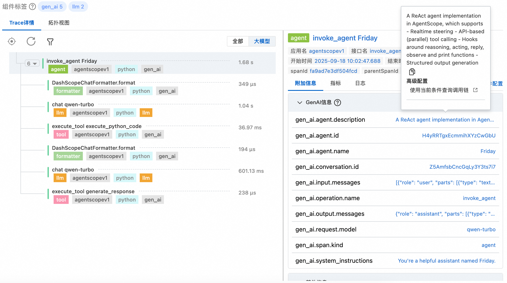
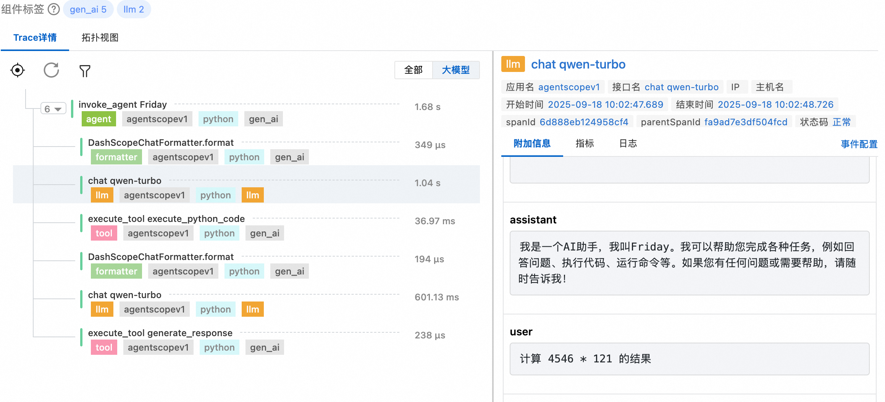
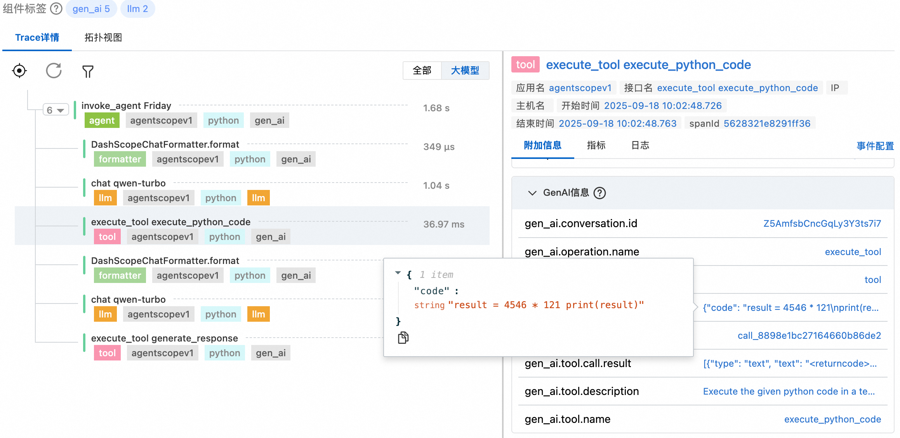
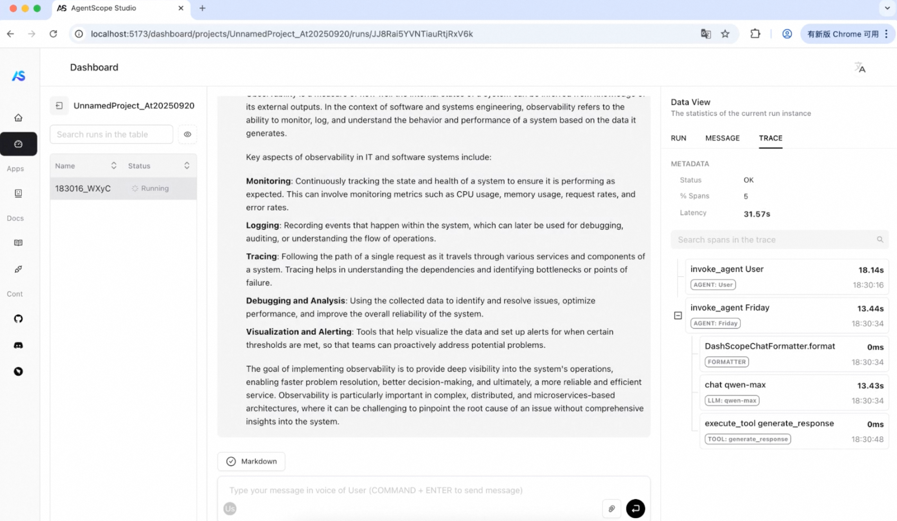
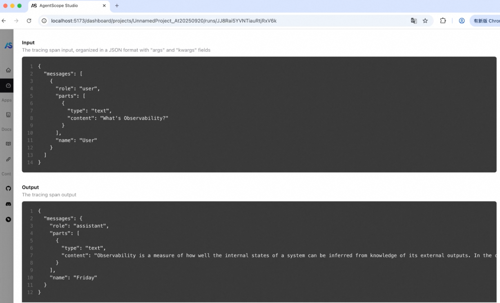
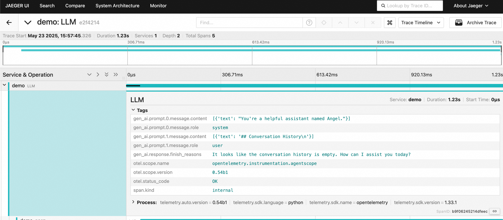

# OpenTelemerty Agentscope Instrumentation

Agentscope Python Agent provides observability for Agentscope applications. This document provides examples of usage and results in the Agentscope instrumentation. For details on usage and installation of LoongSuite and Jaeger, please refer to [LoongSuite Documentation](https://github.com/alibaba/loongsuite-python-agent/blob/main/README.md).

*Pull Request: [Add support for agentscope](https://github.com/alibaba/loongsuite-python-agent/pull/2).*

## INSTALL

Use the following commands to install OpenTelemetry, agentscope, and AgentScopeInstrumentor

```shell
#Opentelemetry
pip install opentelemetry-distro opentelemetry-exporter-otlp
opentelemetry-bootstrap -a install

#agentscope
pip install agentscope

#AgentScopeInstrumentor
git clone https://github.com/alibaba/loongsuite-python-agent.git
cd loongsuite-python-agent
pip install ./instrumentation-genai/opentelemetry-instrumentation-agentscope
```

## RUN

## AgentScope V1

Follow the official [agentscope example](https://github.com/agentscope-ai/agentscope/tree/main/examples) to instrument a example demo such as `examples/functionality/structured_output/main.py`

## Quick Start

You can automatically instrument your AgentScope application using the `opentelemetry-instrument` command:

```bash
opentelemetry-instrument \
    --traces_exporter console \
    --metrics_exporter console \
    python examples/functionality/structured_output/main.py 
```
If everything is working correctly, you should see logs similar to the following
```json
{
    "name": "invoke_agent Friday",
    "context": {
        "trace_id": "0xfe4bc5bb9da01f6c3af93d16628e6f6c",
        "span_id": "0x5198826f9fc1b744",
        "trace_state": "[]"
    },
    "kind": "SpanKind.INTERNAL",
    "parent_id": null,
    "start_time": "2025-09-18T07:14:07.458406Z",
    "end_time": "2025-09-18T07:14:09.388674Z",
    "status": {
        "status_code": "OK"
    },
    "attributes": {
        "gen_ai.span.kind": "agent",
        "gen_ai.conversation.id": "cSqkWAVi54oaRU8Msg6uDh",
        "gen_ai.agent.id": "UzohJ5i8CMueXaQpdp4ReS",
        "gen_ai.agent.name": "Friday",
        "gen_ai.agent.description": "A ReAct agent implementation in AgentScope, which supports\n\n- Realtime steering\n- API-based (parallel) tool calling\n- Hooks around reasoning, acting, reply, observe and print functions\n- Structured output generation",
        "gen_ai.operation.name": "invoke_agent",
        "gen_ai.system_instructions": "You are a helpful assistant named Friday.",
        "gen_ai.request.model": "qwen-max",
        "gen_ai.input.messages": "[{\"role\": \"user\", \"parts\": [{\"type\": \"text\", \"content\": \"Choose one of your favorite fruit\"}], \"name\": \"user\"}]",
        "gen_ai.output.messages": "{\"role\": \"assistant\", \"parts\": [{\"type\": \"text\", \"content\": \"I choose apple as one of my favorite fruits. It's crisp, sweet, and very refreshing!\"}], \"name\": \"Friday\"}"
    },
    "events": [],
    "links": [],
    "resource": {
        "attributes": {
            "telemetry.sdk.language": "python",
            "telemetry.sdk.name": "opentelemetry",
            "telemetry.sdk.version": "1.37.0",
            "telemetry.auto.version": "0.57b0",
            "service.name": "unknown_service"
        },
        "schema_url": ""
    }
}
{
    "name": "chat qwen-max",
    "context": {
        "trace_id": "0xfe4bc5bb9da01f6c3af93d16628e6f6c",
        "span_id": "0x851e0d4ef1b184e9",
        "trace_state": "[]"
    },
    "kind": "SpanKind.INTERNAL",
    "parent_id": "0x5198826f9fc1b744",
    "start_time": "2025-09-18T07:14:07.459576Z",
    "end_time": "2025-09-18T07:14:09.387582Z",
    "status": {
        "status_code": "OK"
    },
    "attributes": {
        "gen_ai.span.kind": "llm",
        "gen_ai.conversation.id": "cSqkWAVi54oaRU8Msg6uDh",
        "gen_ai.provider.name": "dashscope",
        "gen_ai.operation.name": "chat",
        "gen_ai.request.model": "qwen-max",
        "gen_ai.input.messages": "[{\"role\": \"system\", \"parts\": [{\"type\": \"text\", \"content\": \"You are a helpful assistant named Friday.\"}]}, {\"role\": \"user\", \"parts\": [{\"type\": \"text\", \"content\": \"Please introduce Einstein\"}]}, {\"role\": \"assistant\", \"parts\": [{\"type\": \"tool_call\", \"name\": \"generate_response\", \"id\": \"call_cd1858cf64ad402f8f64e6\", \"arguments\": {\"name\": \"Albert Einstein\", \"age\": 76, \"intro\": \"Albert Einstein was a German-born theoretical physicist, widely acknowledged to be one of the greatest and most influential physicists of all time.\", \"honors\": [\"Nobel Prize in Physics (1921)\", \"Copley Medal (1925)\", \"Max Planck Medal (1929)\", \"Time Magazine's Person of the Century (1999)\"], \"response\": \"Albert Einstein, who lived to be 76 years old, was a renowned theoretical physicist. He is best known for developing the theory of relativity, but he also made significant contributions to the development of the philosophy of science. Einstein received numerous honors, including the Nobel Prize in Physics in 1921, the Copley Medal in 1925, the Max Planck Medal in 1929, and he was even named Time Magazine's Person of the Century in 1999.\"}}]}, {\"role\": \"tool\", \"parts\": [{\"type\": \"tool_call_response\", \"response\": \"Successfully generated response.\", \"id\": \"call_cd1858cf64ad402f8f64e6\"}]}, {\"role\": \"assistant\", \"parts\": [{\"type\": \"text\", \"content\": \"Albert Einstein, who lived to be 76 years old, was a renowned theoretical physicist. He is best known for developing the theory of relativity, but he also made significant contributions to the development of the philosophy of science. Einstein received numerous honors, including the Nobel Prize in Physics in 1921, the Copley Medal in 1925, the Max Planck Medal in 1929, and he was even named Time Magazine's Person of the Century in 1999.\"}]}, {\"role\": \"user\", \"parts\": [{\"type\": \"text\", \"content\": \"Choose one of your favorite fruit\"}]}]",
        "gen_ai.response.id": "2025-09-18 15:14:09.383_3641e0",
        "gen_ai.output.type": "text",
        "gen_ai.response.finish_reasons": "[\"stop\"]",
        "gen_ai.usage.input_tokens": 594,
        "gen_ai.usage.output_tokens": 45,
        "gen_ai.output.messages": "[{\"role\": \"assistant\", \"parts\": [{\"type\": \"tool_call\", \"id\": \"call_7f25ce38ce304f4eb20a0a\", \"name\": \"generate_response\", \"arguments\": {\"choice\": \"apple\", \"response\": \"I choose apple as one of my favorite fruits. It's crisp, sweet, and very refreshing!\"}}], \"finish_reason\": \"stop\"}]"
    },
    "events": [],
    "links": [],
    "resource": {
        "attributes": {
            "telemetry.sdk.language": "python",
            "telemetry.sdk.name": "opentelemetry",
            "telemetry.sdk.version": "1.37.0",
            "telemetry.auto.version": "0.57b0",
            "service.name": "unknown_service"
        },
        "schema_url": ""
    }
}
{
    "name": "execute_tool generate_response",
    "context": {
        "trace_id": "0xfe4bc5bb9da01f6c3af93d16628e6f6c",
        "span_id": "0xa5b483e5de02c128",
        "trace_state": "[]"
    },
    "kind": "SpanKind.INTERNAL",
    "parent_id": "0x5198826f9fc1b744",
    "start_time": "2025-09-18T07:14:09.388282Z",
    "end_time": "2025-09-18T07:14:09.388612Z",
    "status": {
        "status_code": "OK"
    },
    "attributes": {
        "gen_ai.span.kind": "tool",
        "gen_ai.conversation.id": "cSqkWAVi54oaRU8Msg6uDh",
        "gen_ai.tool.call.id": "call_7f25ce38ce304f4eb20a0a",
        "gen_ai.tool.name": "generate_response",
        "gen_ai.tool.description": "Generate a response. Note only the input argument `response` is\n\nvisible to the others, you should include all the necessary\ninformation in the `response` argument.",
        "gen_ai.tool.call.arguments": "{\"choice\": \"apple\", \"response\": \"I choose apple as one of my favorite fruits. It's crisp, sweet, and very refreshing!\"}",
        "gen_ai.operation.name": "execute_tool",
        "gen_ai.tool.call.result": "[{\"type\": \"text\", \"text\": \"Successfully generated response.\"}]"
    },
    "events": [],
    "links": [],
    "resource": {
        "attributes": {
            "telemetry.sdk.language": "python",
            "telemetry.sdk.name": "opentelemetry",
            "telemetry.sdk.version": "1.37.0",
            "telemetry.auto.version": "0.57b0",
            "service.name": "unknown_service"
        },
        "schema_url": ""
    }
}

```

## Forwarding OTLP Data to the Backend
```shell
export OTEL_SERVICE_NAME=<service_name>
export OTEL_EXPORTER_OTLP_PROTOCOL=http/protobuf
export OTEL_EXPORTER_OTLP_TRACES_ENDPOINT=<trace_endpoint>
export OTEL_EXPORTER_OTLP_METRICS_ENDPOINT=<metrics_endpoint>

opentelemetry-instrument <your_run_command>

```

### Results
#### Export to aliyun xtrace





#### Export to agentscope studio

This version supports OTel data ingestion — please use it for integration [agentscope studio](https://github.com/agentscope-ai/agentscope-studio/pull/7)



## AgentScope V0

### Build the Example

Follow the official [agentscope documentation](https://doc.agentscope.io/) to create a sample file named `demo.py`

```python
from agentscope.agents import DialogAgent, UserAgent
from agentscope.message import Msg
from agentscope import msghub
import agentscope

# Initialize via model configuration for simplicity
agentscope.init(
    model_configs={
        "config_name": "my-qwen-max",
        "model_name": "qwen-max",
        "model_type": "dashscope_chat",
        "api_key": "YOUR-API-KEY",
    },
)
angel = DialogAgent(
    name="Angel",
    sys_prompt="You're a helpful assistant named Angel.",
    model_config_name="my-qwen-max",
)

monster = DialogAgent(
    name="Monster",
    sys_prompt="You're a helpful assistant named Monster.",
    model_config_name="my-qwen-max",
)
msg = None
for _ in range(3):
    msg = angel(msg)
    msg = monster(msg)
```

### Collect Data

There are two ways to run the `demo.py` script with instrumentation:

#### Option 1: Using OpenTelemetry

```shell
opentelemetry-instrument \
--traces_exporter console \
--service_name demo \
python demo.py
```

#### Option 2: Using Loongsuite

```shell
loongsuite-instrument \
--traces_exporter console \
--service_name demo \
python demo.py
```

If everything is working correctly, you should see logs similar to the following

```json
"name": "LLM",
"context": {
    "trace_id": "0xa6acb5a45fb2b4383e4238ecd5187f85",
    "span_id": "0x7457f1a22004468a",

    "trace_state": "[ ]"

},
"kind": "SpanKind.INTERNAL",
"parent_id": null,
"start_time": "2025-05-22T11:13:40.396188Z",
"end_time": "2025-05-22T11:13:41.013896Z",
"status": {
    "status_code": "OK"
},
"attributes": {
    "gen_ai.prompt.0.message.role": "system",

    "gen_ai.prompt.0.message.content": "[ ]",

    "gen_ai.prompt.1.message.role": "user",

    "gen_ai.prompt.1.message.content": "[ ]",

    "gen_ai.response.finish_reasons": "3"
},

"events": [ ],


"links": [ ],

"resource": {
    "attributes": {
        "telemetry.sdk.language": "python",
        "telemetry.sdk.name": "opentelemetry",
        "telemetry.sdk.version": "1.33.1",
        "service.name": "demo",
        "telemetry.auto.version": "0.54b1"
    },
    "schema_url": ""
}
```

## Forwarding OTLP Data to Jaeger via LoongCollector

### Launch Jaeger

Launch Jaeger with Docker

```shell
docker run --rm --name jaeger \
  -e COLLECTOR_ZIPKIN_HOST_PORT=:9411 \
  -p 6831:6831/udp \
  -p 6832:6832/udp \
  -p 5778:5778 \
  -p 16686:16686 \
  -p 4317:4317 \
  -p 4318:4318 \
  -p 14250:14250 \
  -p 14268:14268 \
  -p 14269:14269 \
  -p 9411:9411 \
  jaegertracing/all-in-one:1.53.0
```

### Launch LoongCollector

1.  Install the latest LoongCollector code based on its [documentation](https://observability.cn/project/loongcollector/quick-start/).
    
2.  Add the following configuration in the `conf/continuous_pipeline_config/local/oltp.yaml` directory:
    

```yaml
enable: true
global:
  StructureType: v2
inputs:
  - Type: service_otlp
    Protocols:
      GRPC:
        Endpoint: 0.0.0.0:6666
flushers:
  - Type: flusher_otlp
    Traces:
      Endpoint: http://127.0.0.1:4317
```

This configuration specifies that LoongCollector will accept OTLP-formatted data over the gRPC protocol on port 6666. It also configures an OTLP flusher to send trace data to the backend at port 4317 (which corresponds to Jaeger). For simplicity, only traces are configured here, but metrics and logs can be added similarly. 

3.  Launch  LoongCollector with the following command：
    

```shell
nohup ./loongcollector > stdout.log 2> stderr.log &
```

## Run the Agentscope Example

There are two ways to run the agentscope example:

### Option 1: Using OpenTelemetry

```shell
opentelemetry-instrument \
--exporter_otlp_protocol grpc \
--traces_exporter otlp \
--exporter_otlp_insecure true \
--exporter_otlp_endpoint 127.0.0.1:6666 \
--service_name demo \
python demo.py
```

### Option 2: Using Loongsuite

```shell
loongsuite-instrument \
--exporter_otlp_protocol grpc \
--traces_exporter otlp \
--exporter_otlp_insecure true \
--exporter_otlp_endpoint 127.0.0.1:6666 \
--service_name demo \
python demo.py
```

### Results

Access the Jaeger UI to view the collected trace data. You should now see trace information being properly received.

