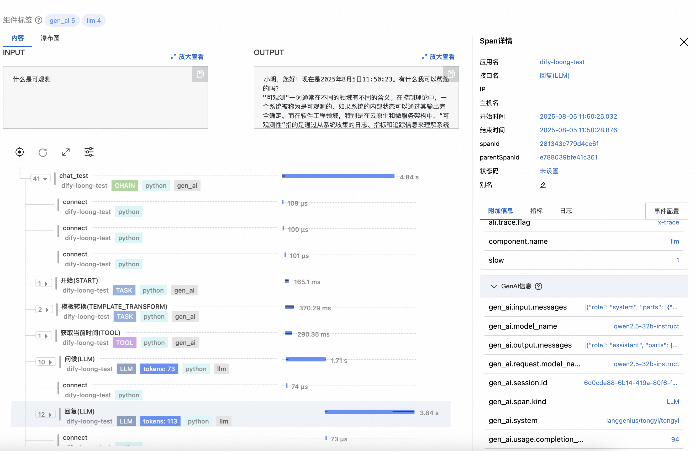

# OpenTelemerty Dify Instrumentation

Dify Python Agent provides observability for Dify applications. This document provides examples of usage and results in the Dify instrumentation. For details on usage and installation of LoongSuite and Jaeger, please refer to [LoongSuite Documentation](https://github.com/alibaba/loongsuite-python-agent/blob/main/README.md).

## Installation Dify Instrumentation

```shell
#DifyInstrumentor
git clone https://github.com/alibaba/loongsuite-python-agent.git
cd loongsuite-python-agent
pip install ./instrumentation-genai/opentelemetry-instrumentation-dify
```

## RUN Dify
Start Dify self-hosted by following the official documentation:
[Installing Dify Self-Hosted](https://docs.dify.ai/en/getting-started/install-self-hosted/readme)

## Collect Data

### Setting Environment Variables

```plaintext
# Configure OpenTelemetry environment variables
OTEL_EXPORTER_OTLP_TRACES_ENDPOINT = <trace_endpoint>
OTEL_EXPORTER_OTLP_PROTOCOL = http/protobuf
OTEL_SERVICE_NAME = <service_name>
```

### Option 1: Modify Entry Source Code

Modify the project's entry file (`api/app.py`) and add the Loongsuit initialization logic at the beginning of the file:

```python
# Import OpenTelemetry auto instrumentation module
from opentelemetry.instrumentation.auto_instrumentation import sitecustomize
```

### Option 2: Starting with loongsuite-instrument

Modify the project's startup script (`entrypoint.sh`) to use loongsuite-instrument for application startup. Example:

```shell
loongsuite-instrument gunicorn \
      --bind "${DIFY_BIND_ADDRESS:-0.0.0.0}:${DIFY_PORT:-5001}" \
      --workers ${SERVER_WORKER_AMOUNT:-1} \
      --worker-class ${SERVER_WORKER_CLASS:-gevent} \
      --worker-connections ${SERVER_WORKER_CONNECTIONS:-10} \
      --timeout ${GUNICORN_TIMEOUT:-200} \
      app:app
```

### Results
