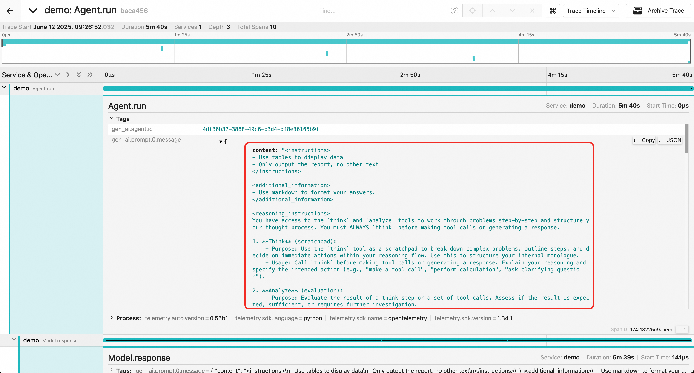
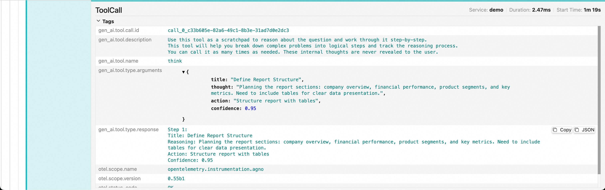

# OpenTelemerty Agno Instrumentation

Agno Python Agent provides observability for Agno applications. This document provides examples of usage and results in the Agno instrumentation. For details on usage and installation of LoongSuite and Jaeger, please refer to [LoongSuite Documentation](https://github.com/alibaba/loongsuite-python-agent/blob/main/README.md).

## Installation
  
```shell
git clone https://github.com/alibaba/loongsuite-python-agent.git
pip install ./instrumentation-loongsuite/loongsuite-instrumentation-agno
```

## RUN

### Build the Example

Follow the official [Agno Documentation](https://docs.agno.com/introduction) to create a sample file named `demo.py`
```python
import os
os.environ["DEEPSEEK_API_KEY"] = "YOUR-API-KEY"
from agno.agent import Agent
from agno.models.deepseek import DeepSeek
from agno.tools.reasoning import ReasoningTools
from agno.tools.yfinance import YFinanceTools
agent = Agent(
    model=DeepSeek(id="deepseek-reasoner"),
    tools=[
        ReasoningTools(add_instructions=True),
    ],
    instructions=[
        "Use tables to display data",
        "Only output the report, no other text",
    ],
    markdown=True,
)
agent.print_response(
    "Write a report on NVDA",
    stream=False,
)
```

### Collect Data

There are two ways to run the `demo.py` script with instrumentation:

### Option 1: Using OpenTelemetry

```shell 
export OTEL_INSTRUMENTATION_GENAI_CAPTURE_MESSAGE_CONTENT=true

opentelemetry-instrument \
--exporter_otlp_protocol grpc \
--traces_exporter otlp \
--exporter_otlp_insecure true \
--exporter_otlp_endpoint YOUR-END-POINT \
--service_name demo \
python demo.py
```

### Option 2: Using Loongsuite

```shell 
export OTEL_INSTRUMENTATION_GENAI_CAPTURE_MESSAGE_CONTENT=true

loongsuite-instrument \
--exporter_otlp_protocol grpc \
--traces_exporter otlp \
--exporter_otlp_insecure true \
--exporter_otlp_endpoint YOUR-END-POINT \
--service_name demo \
python demo.py
```

## RESULT

Access the Jaeger UI to view the collected trace data. Trace information should contains:

### 1. Prompt



### 2. Reasoning & Response


### 3. ToolCalls



### 4. Other

We also collect other information interest to users, including historical messages, token consumption, model types, etc.
