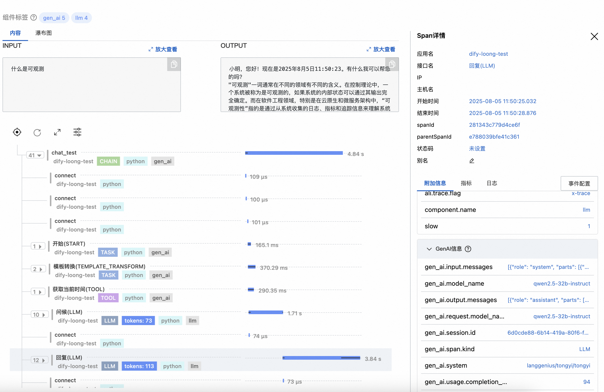

# LoongSuite Dify Instrumentation

Dify Python Agent provides observability for Dify applications. This document provides examples of usage and results in the Dify instrumentation. For details on usage and installation of LoongSuite and Jaeger, please refer to [LoongSuite Documentation](https://github.com/alibaba/loongsuite-python-agent/blob/main/README.md).

## Installing Dify Instrumentation

```shell
# Step 1: install LoongSuite distro
pip install loongsuite-distro

# Step 2 (Option A): install instrumentations from LoongSuite release
loongsuite-bootstrap -a install --latest
# for specific version: loongsuite-bootstrap -a install --version X.Y.Z
```

## RUN Dify
Start Dify self-hosted by following the official documentation:
[Installing Dify Self-Hosted](https://docs.dify.ai/en/getting-started/install-self-hosted/readme)

## Collect Data

### Setting Environment Variables

```plaintext
# Configure OpenTelemetry environment variables
OTEL_EXPORTER_OTLP_TRACES_ENDPOINT = <trace_endpoint>
OTEL_EXPORTER_OTLP_PROTOCOL = http/protobuf
OTEL_SERVICE_NAME = <service_name>
```

### Recommended: Start with loongsuite-instrument

Modify the project's startup script (`entrypoint.sh`) to use loongsuite-instrument for application startup. Example:

```shell
loongsuite-instrument gunicorn \
      --bind "${DIFY_BIND_ADDRESS:-0.0.0.0}:${DIFY_PORT:-5001}" \
      --workers ${SERVER_WORKER_AMOUNT:-1} \
      --worker-class ${SERVER_WORKER_CLASS:-gevent} \
      --worker-connections ${SERVER_WORKER_CONNECTIONS:-10} \
      --timeout ${GUNICORN_TIMEOUT:-200} \
      app:app
```

### Results
